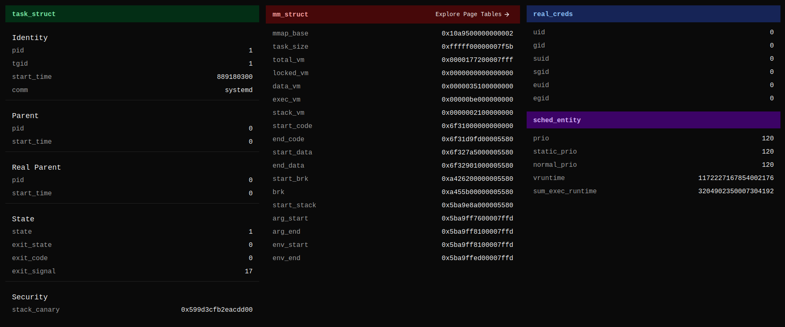
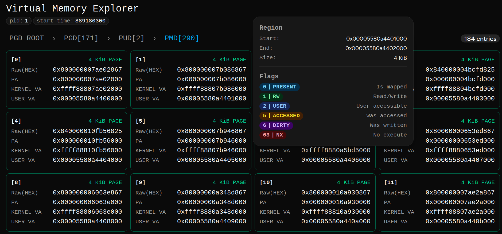
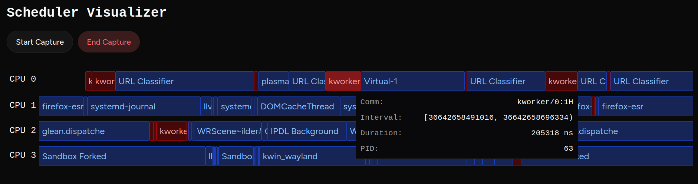

# Kernel Glassbox

> A real-time Linux kernel visualizer/observability tool

## Features

### Process Tree Explorer


Process Tree Explorer lets you visualize the entire tree of the running processes + their internal threads. User-Space processes are colored BLUE and Kernel-Space processes are colored RED.

### Task View



Task View lets you introspect _task_struct_, _mm_struct_, _real_creds_, _sched_entity_ kernel level data structures for each process.

### VM Explorer



Virtual Memory Explorer lets you explore the page tables for each process, see detailed information about each page entry like Physical Memory to User-Space Virtual Memory mapping, page size, page flags and so on.

### Scheduler Visualizer



Scheduler Visualizer lets you capture _sched_switch_ events and visualize per CPU core activity with nanosecond precision.

## Project Structure

### Kernel Out-of-Tree Module (C)

Directly loads into the Linux kernel and communicates to user-space bridge via Generic Netlink protocol.

### Bridge (go)

Bridge connects WebApp(Visualizer) to the Kernel module. It communicates with the kernel via Netlink, processes the received data and acts as a WebSocket server to send the data to web application.

### WebApp(Typescript/React)

Acts as a visualizer. Connects to bridge WebSocket server and subscribes to the events. It can be setup on a remote PC and still connect to the target bridge, given the port is exposed on the target PC.

> Note: Everything under webapp/src/shadcn is part of shadcn/ui library and NOT my code.

## Environment Setup

### Downlaod Linux Kernel v6.12.74 from kernel.org

```bash
git clone --branch v6.12.74 --depth 1 https://git.kernel.org/pub/scm/linux/kernel/git/stable/linux.git
```

### Apply Patch to the Kernel

```bash
git am /path/to/patch/0001-Export-sched-switch-tracepoint.patch
```

### Setup Distro inside QEMU

> QEMU emulator version 10.2.1 was used for testing

> debian-13.3.0 was used for testing

My parameters for running the QEMU:

```bash
qemu-system-x86_64 \
  -enable-kvm \
  -m 4G \
  -smp 4 \
  -device virtio-vga \
  -drive file=debian.qcow2,format=qcow2 \
  -virtfs local,path=/path/to/kernel-glassbox,mount_tag=hostshare,security_model=mapped-xattr,id=hostshare \
  -display gtk \
  -netdev user,id=net0,hostfwd=tcp::9090-:9090 \
  -device virtio-net,netdev=net0
```

`/path/to/kernel-glassbox` is the location of project directory on the host PC.

The QEMU exposes port `9090` for the Web App connection.

You need to create `debian.qcow2` disk before running this.

### Install Debian on QEMU

### Compile the PATCHED kernel inside QEMU

You will need to copy the patched kernel files inside QEMU and then compile it.

#### Configure the Kernel

```bash
cp /boot/config-$(uname -r) .config
make olddefconfig
```

#### Compile the Kernel

```bash
make -j$(nproc)
```

#### Install the Kernel

```bash
sudo make modules_install
sudo make install
```

After this reboot the system into the new kernel

## Usage

Using QEMU virtfs mount the host's `/path/to/kernel-glassbox` in VM's `/mnt/host/` location.

This builds and loads the kernel module into the system

```bash
make kload
```

This starts the go bridge

```bash
make gorun
```

On the host system cd into `/path/to/kernel-glassbox` and run the Web App.

```bash
make webrun
```

The Web App will connect to QEMU via the port 9090 once the first page is opened.
